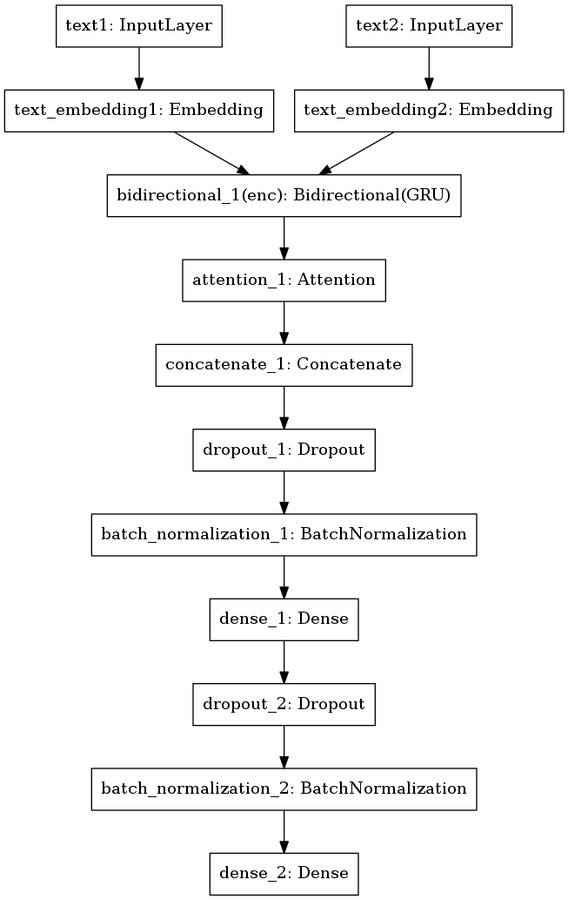

# kaggle-spooky-author-identification
Code for my submission to the [Kaggle Spooky Author Identification Competition](https://www.kaggle.com/c/spooky-author-identification).

### Model

### Requirements
* Python 2.X
* Keras + Tensorflow
* Spacy
* numpy
